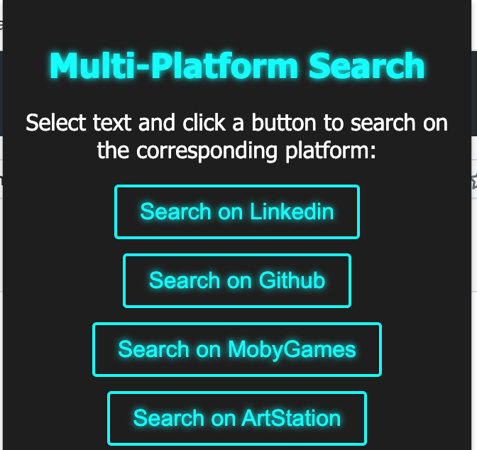

# Multi-Platform Search Extension
Fully created with the help of GPT4.

The Multi-Platform Search Extension is a Chrome extension that allows you to easily search for any selected text on the supported platforms, including LinkedIn Recruiter, which typically/sometimes prevents JavaScript bookmarklets from functioning. The extension is designed to bypass these restrictions and provide a seamless search experience across multiple platforms.

This extension can be easily customized to add any source you want, as long as you know the specific search URL for that platform.

## Features

- Search for selected text on multiple platforms
- Bypass restrictions that prevent JavaScript bookmarklets from working on LinkedIn Recruiter
- Easily customizable to add any additional source with its specific search URL

## How to Use

Install the extension on your Chrome browser. If you have the source files, you can load the extension as an "Unpacked extension" by following these steps:

- Save the files in a zip folder on your PC by clicking on the drop down menu from the Code button at the top right hand corner of this page
- Open the Chrome browser and navigate to chrome://extensions/
- Enable "Developer mode" by clicking the toggle switch in the top right corner
- Click on the "Load unpacked" button, then navigate to the folder containing the extension's source files and select it.
- Once the extension is installed, you will see its icon in the Chrome browser's toolbar.

When you find text on a webpage that you want to search for on one of the supported platforms, simply highlight the text by clicking and dragging your cursor over it.

Click the extension's icon in the toolbar to open the popup. The popup will display buttons for each supported platform.

Choose the platform you want to search the selected text on by clicking the corresponding button in the popup. For example, if you want to search the selected text on LinkedIn, click the "Search on LinkedIn" button.

The search results for the selected text on the chosen platform will open in a new window. You can then browse the search results to find the information you need.

## Customization

To add a new source to the extension, follow these steps:

1. Find the specific search URL for the platform you want to add.
2. Modify the `popup.js` file to include a new case in the switch statement for the new platform, using the search URL you found.
3. Update the `popup.html` file to include a new button for the added platform.
4. Update the event listener in the `popup.js` file to handle the new button's click event.

Feel free to customize the extension to suit your specific needs and preferences. Please share and open source if you added more functionality!
